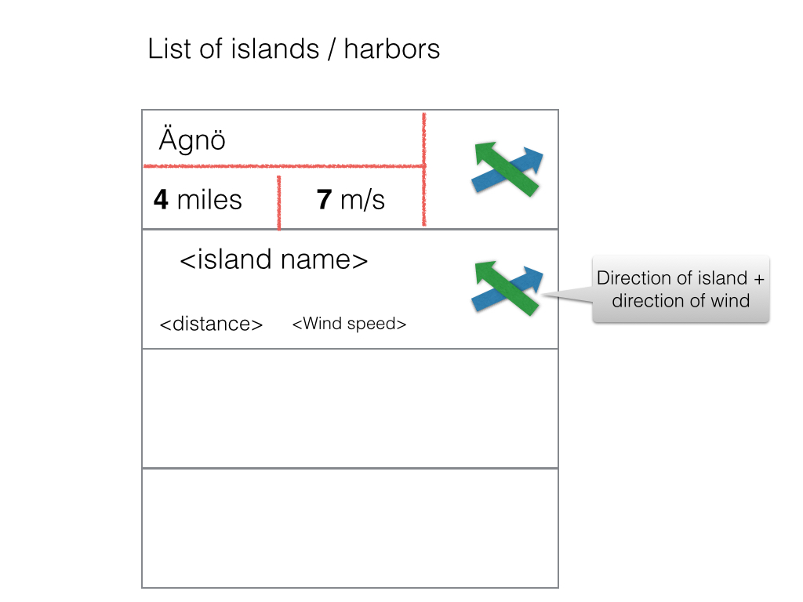
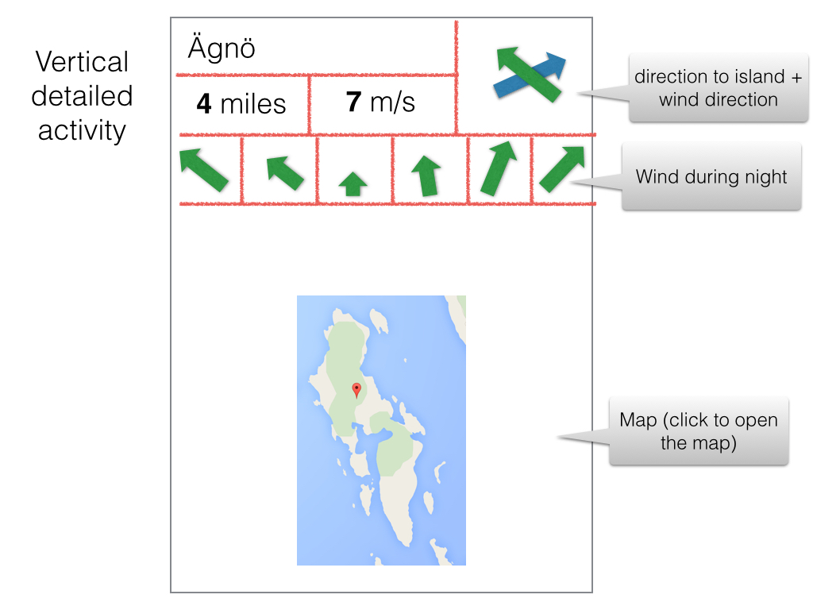
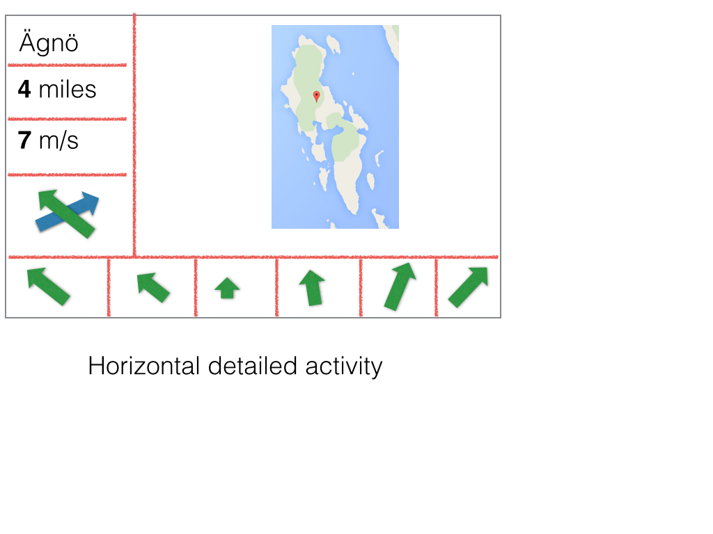

archipelago
===========

Purpose: *Help a sailor find a good place to spend the night while sailing in the Stockholm Archipelago*.

The Stockholm archipelago is rather large (20 to 30 000 islands, depending how you count) and there are numerous places where one can anchor his boat for the night, bays or harbours. <a href="https://goo.gl/maps/oz3uS" target="_blank">An example</a> 

The project helps by providing a list if isldands (or harbors) together with:
* The distance and direction to the place
* The direction fo the wind (at this place)
* The wind direction and force during he night (very important if you need to spend the night in a bay)
* A map of the island
* It opens a map app when clicking on the map

Ideas for later
---------------
* Embedd a map engine inside the app (Google maps?) instead of a simple picture of the island
* See the whole area between the current position and the island.
* Link to http://kartor.eniro.se/ which has a map with sea depth (*very* useful for sailors)
* More weather information for the night?

Design ideas so far
-------------------

